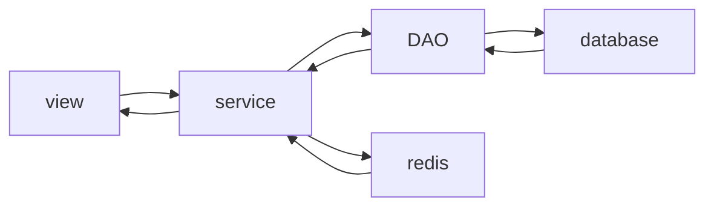

# Springboot讲解分析案例顺序
## 1. 如何创建一个springboot框架web项目
## 2. 使用springboot框架集成springmvc
## 3. 使用springboot框架的核心配置文件application.properties
## 4. 使用springboot框架的核心配置文件application.yml或者application.yaml
如果application.properties和application.yml和application.yaml同时存在，那么优先使用application.properties
## 5. 多环境下的核心配置文件的使用(properties): 开发环境，测试环境，准生产环境，生产环境
```properties
# application-dev.properties 配置文件
# 开发环境配置文件
server.port=8080
```
```properties
# application-test.properties 配置文件
# 测试环境配置文件 
server.port=8081
server.servlet.context-path=/test
```
```properties
# application-ready.properties 配置文件
# 准生产环境配置文件
server.port=8082
server.servlet.context-path=/ready
```
```properties
# application-product.properties 配置文件
# 生产环境配置文件
server.port=8083
server.servlet.context-path=/product
```
```properties
# springboot主核心配置文件
# 激活使用的配置文件 是-后面的单词
spring.profiles.active=ready
```
## 6. 多环境下的核心配置文件的使用(yaml/yml): 开发环境，测试环境，准生产环境，生产环境(同properties)
## 7. 自定义配置文件 (@Value注解)
```java
@Controller
public class indexController {

    @Value("${school.name}")
    private String schoolName;

    @Value("${school.location}")
    private String schoolLocation;

    @RequestMapping(value = "/say")
    @ResponseBody
    public String say(String message) {
        return message + schoolName + schoolLocation;
    }
}
```
```properties
# 设置tomcat端口号
server.port=8080
# 设置上下文根
server.servlet.context-path=/

school.name=JiangSuUniversity
school.location=ZhenJiang
```
## 8. properties在核心配置文件将自定义配置映射到一个对象(必须要有前缀)
```properties
server.port=8081
server.servlet.context-path=/dev
# 如果核心配置文件同名，可以使用对象方式，即加个前缀
boy.name=jack
boy.age=18

girl.name=rose
girl.age=18
```
```java
// 设置boy配置类
@Component
@ConfigurationProperties(prefix = "boy") // 加一个前缀，代表配置文件中的前缀 其实这就是个配置类
public class Boy {
    private String name;
    private String age;

    public String getName() {
        return name;
    }

    public void setName(String name) {
        this.name = name;
    }

    public String getAge() {
        return age;
    }

    public void setAge(String age) {
        this.age = age;
    }
}
```
```java
// 设置girl配置类
@Component
@ConfigurationProperties(prefix = "girl") // 加一个前缀，代表配置文件中的前缀 其实这就是个配置类
public class Girl {
    private String name;
    private String age;

    public String getName() {
        return name;
    }

    public void setName(String name) {
        this.name = name;
    }

    public String getAge() {
        return age;
    }

    public void setAge(String age) {
        this.age = age;
    }
}
```
```java
@Controller
public class IndexController {

    @Autowired
    private Boy boy;

    @Autowired
    private Girl girl;

    @RequestMapping(value = "/student")
    @ResponseBody
    public String student() {
        return boy.getName() +boy.getAge() + girl.getName() + girl.getAge();
    }
}
```
## 9. Springboot集合mybatis
### 1. pom文件中添加mybatis依赖，mysql驱动
```xml
<!-- 添加mysql驱动 -->
<dependency>
    <groupId>mysql</groupId>
    <artifactId>mysql-connector-java</artifactId>
</dependency>
<!-- mybatis整合springboot起步依 -->
<dependency>
    <groupId>org.mybatis.spring.boot</groupId>
    <artifactId>mybatis-spring-boot-starter</artifactId>
    <version>2.2.2</version>
</dependency>
```
### 2. 使用mybatis提供的逆向工程生成实体bean，映射文件，DAO接口
#### 1. 在resources文件夹下创建generatorConfig.xml，文件名一定要是这个
```xml
<?xml version="1.0" encoding="UTF-8"?>
<!DOCTYPE generatorConfiguration
        PUBLIC "-//mybatis.org//DTD MyBatis Generator Configuration 1.0//EN"
        "http://mybatis.org/dtd/mybatis-generator-config_1_0.dtd">
<generatorConfiguration>
    <!--
            targetRuntime: 执行生成的逆向工程的版本
                    MyBatis3Simple: 生成基本的CRUD（清新简洁版）
                    MyBatis3: 生成带条件的CRUD（奢华尊享版）
     -->
    <context id="DB2Tables" targetRuntime="MyBatis3">
        <!-- 数据库的连接信息 -->
        <jdbcConnection driverClass="com.mysql.jdbc.Driver"
                        connectionURL="jdbc:mysql://172.20.10.6:3306/springboot?useUnicode=true&amp;characterEncoding=utf8"
                        userId="root"
                        password="971015.san">
        </jdbcConnection>
        <!-- javaBean的生成策略-->
        <javaModelGenerator targetPackage="com.bjpowernode.springboot.model" targetProject=".\src\main\java">
            <property name="enableSubPackages" value="true" />
            <property name="trimStrings" value="true" />
        </javaModelGenerator>
        <!-- SQL映射文件的生成策略 -->
        <sqlMapGenerator targetPackage="com.bjpowernode.springboot.mapper"  targetProject=".\src\main\java">
            <property name="enableSubPackages" value="true" />
        </sqlMapGenerator>
        <!-- Mapper接口的生成策略 -->
        <javaClientGenerator type="XMLMAPPER" targetPackage="com.bjpowernode.springboot.mapper"  targetProject=".\src\main\java">
            <property name="enableSubPackages" value="true" />
        </javaClientGenerator>
        <!-- 逆向分析的表 -->
        <!-- tableName设置为*号，可以对应所有表，此时不写domainObjectName -->
        <!-- domainObjectName属性指定生成出来的实体类的类名 -->
        <table tableName="DEPT" domainObjectName="Department"/>
        <table tableName="EMP" domainObjectName="Employee"/>
        <table tableName="SALGRADE" domainObjectName="Salary"/>
    </context>
</generatorConfiguration>
```
#### 2. 在pom文件中添加依赖和插件
```xml
<!-- 依赖mybatis核心包 -->
<dependency>
    <groupId>org.mybatis</groupId>
    <artifactId>mybatis</artifactId>
    <version>3.5.7</version>
</dependency>
        <!-- 具体插件，逆向工程的操作是以构建过程中插件形式出现的 -->
<plugin>
    <groupId>org.mybatis.generator</groupId>
    <artifactId>mybatis-generator-maven-plugin</artifactId>
    <version>1.3.0</version>

    <!-- 插件的依赖 -->
    <dependencies>
    
        <!-- 逆向工程的核心依赖 -->
        <dependency>
            <groupId>org.mybatis.generator</groupId>
            <artifactId>mybatis-generator-core</artifactId>
            <version>1.3.2</version>
        </dependency>
    
        <!-- 数据库连接池 -->
        <dependency>
            <groupId>com.mchange</groupId>
            <artifactId>c3p0</artifactId>
            <version>0.9.2</version>
        </dependency>
    
        <!-- MySQL驱动 -->
        <dependency>
            <groupId>mysql</groupId>
            <artifactId>mysql-connector-java</artifactId>
            <version>5.1.8</version>
        </dependency>
    </dependencies>
</plugin>
```

## 10. springboot结合mybatis综合案例，结合前面所有步骤
### 1. 添加mysql和mybatis驱动依赖
```
<!-- 添加mysql连接java驱动依赖 -->
<dependency>
    <groupId>mysql</groupId>
    <artifactId>mysql-connector-java</artifactId>
</dependency>

<!-- 添加mybatis启动依赖 -->
<dependency>
    <groupId>org.mybatis.spring.boot</groupId>
    <artifactId>mybatis-spring-boot-starter</artifactId>
    <version>2.2.2</version>
</dependency>
```
### 2. 使用mybatis逆向工程生成实体bean，映射文件，DAO接口
resources文件夹下添加```generatorConfig.xml```文件
```
<?xml version="1.0" encoding="UTF-8"?>
<!DOCTYPE generatorConfiguration
        PUBLIC "-//mybatis.org//DTD MyBatis Generator Configuration 1.0//EN"
        "http://mybatis.org/dtd/mybatis-generator-config_1_0.dtd">
<generatorConfiguration>
    <!--
            targetRuntime: 执行生成的逆向工程的版本
                    MyBatis3Simple: 生成基本的CRUD（清新简洁版）
                    MyBatis3: 生成带条件的CRUD（奢华尊享版）
     -->
    <context id="DB2Tables" targetRuntime="MyBatis3">
        <!-- 数据库的连接信息 -->
        <jdbcConnection driverClass="com.mysql.jdbc.Driver"
                        connectionURL="jdbc:mysql://172.20.10.6:3306/springboot?useUnicode=true&amp;characterEncoding=utf8"
                        userId="root"
                        password="971015.san">
        </jdbcConnection>
        <!-- javaBean的生成策略-->
        <javaModelGenerator targetPackage="com.bjpowernode.springboot.model" targetProject=".\src\main\java">
            <property name="enableSubPackages" value="true" />
            <property name="trimStrings" value="true" />
        </javaModelGenerator>
        <!-- SQL映射文件的生成策略 -->
        <sqlMapGenerator targetPackage="com.bjpowernode.springboot.mapper"  targetProject=".\src\main\java">
            <property name="enableSubPackages" value="true" />
        </sqlMapGenerator>
        <!-- Mapper接口的生成策略 -->
        <javaClientGenerator type="XMLMAPPER" targetPackage="com.bjpowernode.springboot.mapper"  targetProject=".\src\main\java">
            <property name="enableSubPackages" value="true" />
        </javaClientGenerator>
        <!-- 逆向分析的表 -->
        <!-- tableName设置为*号，可以对应所有表，此时不写domainObjectName -->
        <!-- domainObjectName属性指定生成出来的实体类的类名 -->
        <table tableName="DEPT" domainObjectName="Department"/>
        <table tableName="EMP" domainObjectName="Employee"/>
        <table tableName="SALGRADE" domainObjectName="Salary"/>
    </context>
</generatorConfiguration>
```
pom文件内添加generator插件的依赖和环境
```
<!-- 具体插件，逆向工程的操作是以构建过程中插件形式出现的 -->
<plugin>
    <groupId>org.mybatis.generator</groupId>
    <artifactId>mybatis-generator-maven-plugin</artifactId>
    <version>1.3.0</version>

    <!-- 插件的依赖 -->
    <dependencies>

        <!-- 逆向工程的核心依赖 -->
        <dependency>
            <groupId>org.mybatis.generator</groupId>
            <artifactId>mybatis-generator-core</artifactId>
            <version>1.3.2</version>
        </dependency>

        <!-- 数据库连接池 -->
        <dependency>
            <groupId>com.mchange</groupId>
            <artifactId>c3p0</artifactId>
            <version>0.9.2</version>
        </dependency>

        <!-- MySQL驱动 -->
        <dependency>
            <groupId>mysql</groupId>
            <artifactId>mysql-connector-java</artifactId>
            <version>5.1.8</version>
        </dependency>
    </dependencies>
</plugin>
```
### 3. 创建Controller类
```java
package com.bjpowernode.springboot.controller;

import com.bjpowernode.springboot.model.Employee;
import com.bjpowernode.springboot.service.EmployeeService;
import org.springframework.beans.factory.annotation.Autowired;
import org.springframework.stereotype.Controller;
import org.springframework.web.bind.annotation.RequestMapping;
import org.springframework.web.bind.annotation.ResponseBody;

@Controller
public class EmployeeController {

    // 注入service类
    @Autowired
    private EmployeeService employeeService;

    /**
     * 利用service类中的查询方法查询员工信息
     * @param empno 员工编号
     * @return 员工信息
     */
    @RequestMapping(value = "/employee")
    @ResponseBody
    public Employee queryEmployeeByEmpno(Integer empno) {
        Employee employee = employeeService.queryEmployeeByEmpno(empno);
        return employee;
    }
}
```
### 4. 根据Controller类创建service接口和其对应的实例
1. service接口
```java
package com.bjpowernode.springboot.service;

import com.bjpowernode.springboot.model.Employee;

public interface EmployeeService {
    Employee queryEmployeeByEmpno(Integer empno);
}

```
2. service实例(添加@Service注解)
```java
package com.bjpowernode.springboot.service.impl;

import com.bjpowernode.springboot.mapper.EmployeeMapper;
import com.bjpowernode.springboot.model.Employee;
import com.bjpowernode.springboot.service.EmployeeService;
import org.springframework.beans.factory.annotation.Autowired;
import org.springframework.stereotype.Service;

@Service
public class EmployeeServiceImpl implements EmployeeService {

    // 自动注入DAO
    @Autowired
    private EmployeeMapper employeeMapper;

    /**
     * DAO层查询员工信息
     * @param empno 员工编号
     * @return 员工信息
     */
    @Override
    public Employee queryEmployeeByEmpno(Integer empno) {
        return employeeMapper.selectByPrimaryKey(empno);
    }
}
```
### 5. 在启动类上添加@MapperScan注解，扫描所有的mapper文件
```java
package com.bjpowernode.springboot;

import org.mybatis.spring.annotation.MapperScan;
import org.springframework.boot.SpringApplication;
import org.springframework.boot.autoconfigure.SpringBootApplication;

@SpringBootApplication
@MapperScan(basePackages = "com.bjpowernode.springboot.mapper") //需要扫描的文件夹
public class Springboot010MybatisAllStepApplication {

    public static void main(String[] args) {
        SpringApplication.run(Springboot010MybatisAllStepApplication.class, args);
    }

}

```
### 6. application.properties中设置连接数据库的配置项
```properties
# 设置连接数据库配置
# mysql 8之后驱动是安装在cj.jdbc.Driver中的
spring.datasource.driver-class-name=com.mysql.cj.jdbc.Driver
spring.datasource.url=jdbc:mysql://172.20.10.6:3306/springboot?useUnicode=true&characterEncoding=utf8
spring.datasource.username=root
spring.datasource.password=971015.san
```
### 7. 编译过程中，mapper文件夹下的.xml文件不会进行编译，因此手动指定资源文件夹
```xml

<build>
    <!-- 手动指定文件夹为resources资源文件夹-->
    <resources>
        <resource>
            <directory>src/main/java</directory>
            <includes>
                <include>**/*.xml</include>
            </includes>
        </resource>
    </resources>
</build>

```

## 11. springboot项目下使用事务
事务是一个完整的功能，也叫做一个完整的业务，事务只跟什么sql语句有关系？ 答: DML，即增删改
1. DML (Data Manipulation Language，数据操纵语言): 主要用于对数据库对象中包含的数据进行操作

代表指令: 
+ ```insert``` 向数据库中插入一条数据
+ ```delete``` 删除表中的一条或者多条记录
+ ```update``` 修改表中的数据

2. DQL (Data Query Language，数据查询语言): 主要用于查询数据库当中的数据

代表指令:
+ ```select``` 查询表中数据
+ ```from``` 查询哪张表、视图
  + ```where``` 约束条件

3. DDL (Data Definition Language，数据定义语言): 主要用于维护存储数据的结构，这种结构包括数据库，表、视图、索引、同义词、聚簇等。

代表指令：
+ ```create``` 创建数据库和数据库的一些对象
+ ```drop``` 删除数据库/表、索引、条件约束以及数据表的权限等
+ ```alter``` 修改数据库表的定义及数据属性

4. TCL (Transaction Control Language 事务控制语言):

5. DCL (Data Control Language，数据控制语言): 主要控制数据库对象的权限管理、事务和实时监视。

代表指令：
+ ```grant``` 分配权限给用户
+ ```revoke``` 废除数据库中某用户的权限
+ ```rollback``` 退回到某一点 (回滚）
+ ```commit``` 提交

<font color="pink">当springboot下使用事务时候，只需要在方法上添加@Transaction注解即可</font>

## 12. springMVC常用注解
+ @RestController (控制层)

添加此注解相当于在控制类上添加@Controller和在方法上添加@ResponseBody，意味着当前控制层类中所有方法返回的都是JSON对象

+ @GetMapping(value = "/student")

相当于@RequestMapping(value="/student", method=RequestMethod.GET)，只能用于GET请求。
+ @PostMapping 同上
+ @DeleteMapping 同上
+ @PutMapping 同上

## 13. springboot集成redis
redis不需要访问DAO层，redis减少对数据库的访问，效率更高。

### 1. 添加redis数据类型的依赖
```xml
<!-- 添加springboot集成redis起步依赖 -->
<dependency>
    <groupId>org.springframework.boot</groupId>
    <artifactId>spring-boot-starter-data-redis</artifactId>
</dependency>
```
### 2. 在springboot核心配置文件中添加redis的配置
```xml
spring.redis.host=172.20.10.6
spring.redis.port=6379
spring.redis.password=971015.san
```
### 3. 实际操作
+ 创建springboot工程
+ 添加环境依赖
+ 添加redis配置文件
+ Controller层
```java
package com.bjpowernode.springboot.web;

import com.bjpowernode.springboot.service.RedisService;
import org.springframework.beans.factory.annotation.Autowired;
import org.springframework.web.bind.annotation.RequestMapping;
import org.springframework.web.bind.annotation.RestController;

@RestController
public class RedisController {

    @Autowired
    private RedisService redisService;

    @RequestMapping(value = "/put")
    public Object put(String key, String value) {
        redisService.put(key, value);
        return "Redis放入key:" + key + "，value: " + value;
    }

    @RequestMapping(value = "/get")
    public Object get(String key) {
        String value = redisService.get(key);
        return "获得key：" + key + "的值value: " + value;
    }
}
```
+ Serive层接口和实现类
```java
package com.bjpowernode.springboot.service;
// service接口
public interface RedisService {
    void put(String key, String value);

    String get(String key);
}

```
```java
package com.bjpowernode.springboot.service.impl;

import com.bjpowernode.springboot.service.RedisService;
import org.springframework.beans.factory.annotation.Autowired;
import org.springframework.data.redis.core.RedisTemplate;
import org.springframework.stereotype.Service;

// service实现类
@Service
public class RedisServiceImpl implements RedisService {

    @Autowired
    private RedisTemplate<Object,Object> redisTemplate;

    @Override
    public void put(String key, String value) {
        redisTemplate.opsForValue().set(key,value);
    }

    @Override
    public String get(String key) {
        String value = (String) redisTemplate.opsForValue().get(key);
        return value;
    }
}
```

## 14.springboot创建普通java工程 (了解即可)
在创建过程中不需要选择springweb工程
### 1. 获取spring容器
```java
@SpringBootApplication
public class Springboot014JavaApplication {

  public static void main(String[] args) {
    /*
     * springboot容器启动后，返回值是ConfigurableApplicationContext，他也是spring的一个容器，其实相当于原来spring容器中启动容器的ClasspathXmlApplicationContext
     */
    // 获取spring容器
    ConfigurableApplicationContext applicationContext =  SpringApplication.run(Springboot014JavaApplication.class, args);
    // 获取spring容器中的方法
    StudentService studentService = (StudentService) applicationContext.getBean("studentServiceImpl");
    System.out.println(studentService.sayHello());
  }
}
```

### 继承CommandLineRunner方法
```java
@SpringBootApplication
public class Springboot015JavaApplication implements CommandLineRunner {

    @Autowired
    private StudentService studentService;

    public static void main(String[] args) {
        SpringApplication.run(Springboot015JavaApplication.class, args);
    }

    @Override
    public void run(String... args) throws Exception {
        studentService.sayHello("继承自CommandLineRunner");
    }
}
```

## 16. springboot使用拦截器
### 1. 定义一个拦截器，实现HandlerInterceptor接口
```java
package com.bjpowernode.springboot.interceptor;

import com.bjpowernode.springboot.model.User;
import org.springframework.web.servlet.HandlerInterceptor;
import org.springframework.web.servlet.ModelAndView;

import javax.servlet.http.HttpServletRequest;
import javax.servlet.http.HttpServletResponse;

// 定义一个用户拦截器 继承自HandlerInterceptor
public class UserInterceptor implements HandlerInterceptor {

    private String username;

    @Override
    public boolean preHandle(HttpServletRequest request, HttpServletResponse response, Object handler) throws Exception {
        // 编写业务信息
        // 1. 从session中获取用户信息
       User user = (User) request.getSession().getAttribute("user");

       // 2. 判断用户是否登录
       if (null == user) {
           response.sendRedirect(request.getContextPath() + "/nologin");
           return false;
       }
       return true;

       // return HandlerInterceptor.super.preHandle(request, response, handler);
    }

    @Override
    public void postHandle(HttpServletRequest request, HttpServletResponse response, Object handler, ModelAndView modelAndView) throws Exception {
        HandlerInterceptor.super.postHandle(request, response, handler, modelAndView);
    }

    @Override
    public void afterCompletion(HttpServletRequest request, HttpServletResponse response, Object handler, Exception ex) throws Exception {
        HandlerInterceptor.super.afterCompletion(request, response, handler, ex);
    }
}

```
### 2. 创建一个配置类(即：在springMVC配置文件中使用mvc：interceptors标签)
```java
package com.bjpowernode.springboot.config;

import com.bjpowernode.springboot.interceptor.UserInterceptor;
import org.springframework.context.annotation.Configuration;
import org.springframework.web.servlet.config.annotation.InterceptorRegistry;
import org.springframework.web.servlet.config.annotation.WebMvcConfigurer;

@Configuration // 定义此类为配置类，(即相当于之前的xml文件)
public class InterceptorConfig implements WebMvcConfigurer {
    @Override
    public void addInterceptors(InterceptorRegistry registry) {
        String[] addPathPatterns = {
                "/user/**"
        };

        String[] excludePathPatterns = {
                "/user/mysql/login"
        };

        // 添加自定义的拦截器 添加拦截的路径 添加排除拦截的路径
        registry.addInterceptor(new UserInterceptor()).addPathPatterns(addPathPatterns).excludePathPatterns(excludePathPatterns);
        WebMvcConfigurer.super.addInterceptors(registry);
    }
}

```

### 3. 控制层发送请求
```java
package com.bjpowernode.springboot.controller;

import com.bjpowernode.springboot.model.User;
import com.bjpowernode.springboot.service.UserService;
import org.springframework.beans.factory.annotation.Autowired;
import org.springframework.web.bind.annotation.RequestMapping;
import org.springframework.web.bind.annotation.ResponseBody;
import org.springframework.web.bind.annotation.RestController;

import javax.servlet.http.HttpServletRequest;

@RestController // RestController括号中的value是spring容器中bean的名称，并不是路径名，如果需要使用路径，那么需要添加RequestMapping
@RequestMapping(value = "/user/mysql")
public class UserMySQLController {
  @RequestMapping(value = "/login")
  public Object login(HttpServletRequest request, Integer id) {
    User user = new User();
    user.setName("lisi");
    user.setAge(22);
    request.getSession().setAttribute("user", user);
    return "login SUCCESS";
  }

  // 用户中心，该请求需要用户登录之后才可以访问
  @RequestMapping(value = "/center")
  public Object center() {
    return "see center message";
  }
}
```


## 99.遇到的问题
### 1. Client does not support authentication protocol requested by server; consider upgrading MySQL client

+ 解决办法
  [点击此处](https://stackoverflow.com/questions/50093144/mysql-8-0-client-does-not-support-authentication-protocol-requested-by-server?r=SearchResults)

Execute the following query in MYSQL Workbench

```
ALTER USER 'root'@'localhost' IDENTIFIED WITH mysql_native_password BY 'password';
```

Where ```root``` as your user ```localhost``` as your URL and ```password``` as your password

Then run this query to refresh privileges:

```
flush privileges;
```

Try connecting using node after you do so.

If that doesn't work, try it without ```
@'localhost'``` part.

### 2. Unknown initial character set index ‘255‘ received from server. Initial client character
+ 解决办法
```markdown
String url = “jdbc:mysql://localhost:3306/springboot?useUnicode=true&amp;characterEncoding=utf8”;//改成这句，就可以了
```
### 3. 连接数据库时候，出现Can't connect to Mysql server on 'xxx' (10060 "Unknown error")，是因为linux防火墙没有关闭，关闭防火墙即可
```markdown
1:查看防火状态

systemctl status firewalld

service  iptables status

2:暂时关闭防火墙

systemctl stop firewalld

service  iptables stop

3:永久关闭防火墙

systemctl disable firewalld

chkconfig iptables off

4:重启防火墙

systemctl enable firewalld

service iptables restart  

5:永久关闭后重启

//暂时还没有试过

chkconfig iptables on
```
### 4. 无法注入 Field salGradeService in com.bjpowernode.springboot.controller.SalGrade required a bean of type 'com.bjpowernode.springboot.service.SalGradeService' that could not be found. 因为没有在service实现类添加@Service注释
## 100. 注意事项
### 1. 启动linux系统后，需要开启mysql服务


